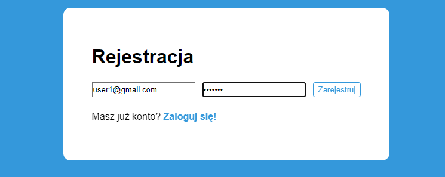
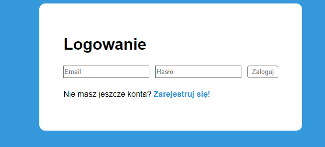
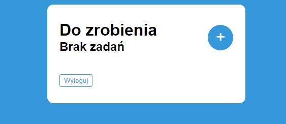
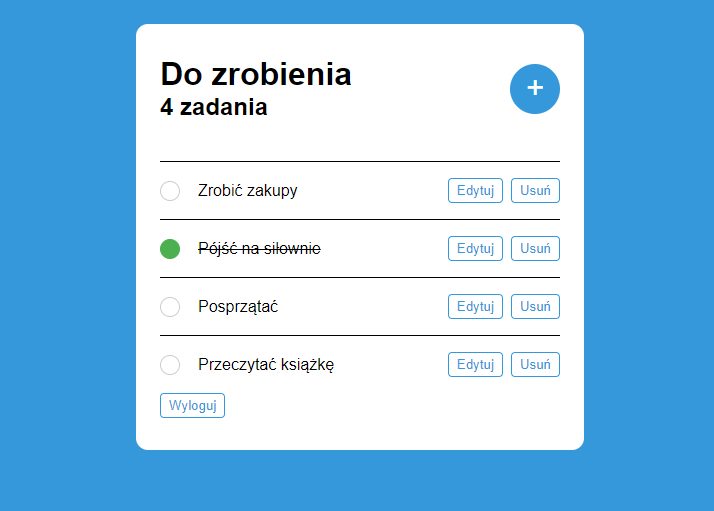

# Todo App with React and Firebase

This is a simple Todo application built using **React** for the frontend and **Firebase** for authentication and database management. The app allows users to create, read, update, and delete tasks. Firebase handles user authentication (sign up, login, and logout) and stores tasks in a Firestore database.

## Features

- **User Authentication**: Users can sign up, log in, and log out using Firebase Authentication.
- **CRUD Operations for Todos**: Users can create, read, update, and delete tasks.
- **Firestore Database**: Todos are stored in a Firestore database.

## Technologies Used

- **React**: JavaScript library for building user interfaces.
- **Firebase**: Provides authentication and Firestore database.
- **Firestore**: Cloud database to store todos.

https://toappdo.netlify.app

## Screenshots

